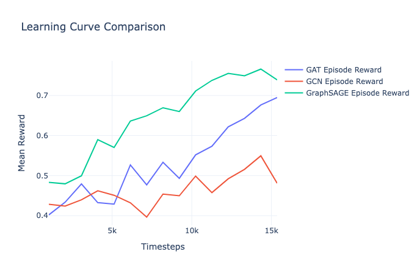
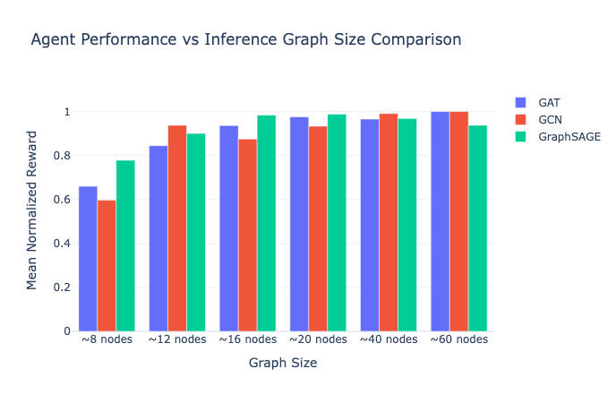

# Graph RL for Network Interdiction Problem

This project is a demonstration of a Graph Neural Network + Reinforcement Learning (GraphRL) pipeline applied to the Network Interdiction problem. It serves as an educational exercise to show how to formulate combinatorial edge-selection problems as RL tasks using modern PyTorch libraries.

**Motivation**: Network Interdiction is a two-player game where an interdictor (blue team) removes edges from a flow network to minimize the maximum flow achievable by an operator (red team). Classical solvers struggle with large graphs. DeepRL, specifically using GNNs, can learn heuristics that operate quickly at inference time.

**Reference**: This project adapts the GNN-RL architecture from [RL-with-GNNs](https://github.com/alex-schutz/RL-with-GNNs) (Schutz & Darvariu, ICLR 2026 Blogpost Track). We diverge by formulating the environment specifically for edge-actions via Line Graph transformation and employing a simplified MLP-based action head as well as formulating the network interdiction problem as described in [Graph Reinforcement Learning for Courses of Action Analysis]([10.1109/ICMCIS61231.2024.10540763](https://ieeexplore.ieee.org/document/10540763)).

## Architecture Overview

The pipeline consists of the following components:
1. **Flow Network Generation**: Creates directed grid-based flow networks with configurable capacities.
2. **Line Graph Transform**: Converts the flow network edges into nodes of an undirected line graph.
3. **Environment**: A Gymnasium `Env` that tracks graph state, calculates maximum flow (via NetworkX), and provides dense rewards for interdiction.
4. **Policy**: A custom SB3 `MaskableActorCriticPolicy` that embeds graphs using PyTorch Geometric (GCN, GAT, or GraphSAGE) and uses an MLP to predict action logits.

## Installation

This project requires standard deep learning and RL libraries.

```bash
pip install torch torchvision torchaudio
pip install torch_geometric
pip install stable-baselines3 sb3-contrib
pip install networkx numpy matplotlib plotly jupyter
```

## Running the Code

1. **Notebook Demo (Recommended)**: Open `graphRL_netInterdiction.ipynb`. This notebook provides a step-by-step walkthrough of graph generation, environment dynamics, and training with interactive Plotly visualizations. It also contains unit-test cells for the educational implementation tasks.
2. **CLI Training**:
   ```bash
   python train.py --network GAT --timesteps 50000
   ```

## Evaluation Results





## Project Structure

```
graph_nip/
├── config.py         # Configuration dataclasses
├── graph_gen.py      # Flow network generator (Task 1)
├── utils.py          # Line graph conversion (Task 2)
├── env.py            # Gym environment (Tasks 3 & 4)
├── gnns.py           # PyG Neural Networks (GCN, GAT, GraphSAGE)
└── policy.py         # Custom SB3 Policy with MLP Head (Task 5)
train.py              # Training script
```

## Limitations & Future Extensions

- **CPU-Only**: Designed for fast CPU execution on small graphs (~10-20 nodes). Not tuned for GPU clusters or massive scale.
- **Binary Interdiction**: Edges are fully removed (capacity 0). Partial capacity reduction is not supported.
- **Dense Padded Tensors**: Uses dense batching to integrate easily with Stable Baselines 3 `DummyVecEnv`. For larger graphs, custom PyG batching wrappers would be more memory efficient.
- **Single Agent**: Only the interdictor policy is learned; the flow operator acts optimally via exact max-flow calculation.

